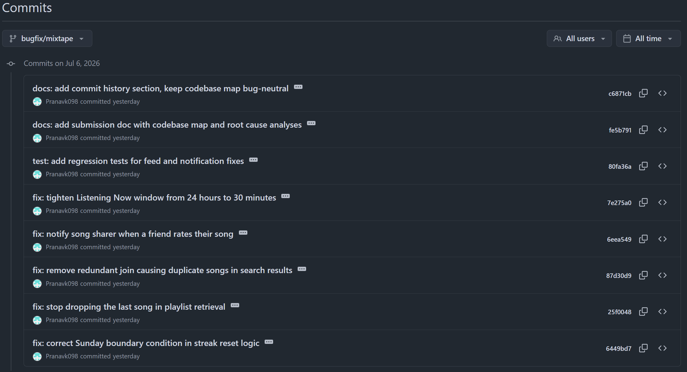

# Mixtape Bug Hunt — Submission

## AI Usage

I used Claude (via Claude Code) throughout this project as a pair-programming assistant, with the workflow the assignment recommends: read the code myself first, then use AI to explain/trace/verify rather than to guess the bug.

- **Codebase orientation**: I had Claude read `app.py`, `models.py`, all of `routes/`, and all of `services/` directly (not summarized secondhand) and asked it to describe each file's responsibility so I could write the codebase map below with actual file contents in view rather than from the file tree alone.
- **Tracing execution**: For Issue #3 (search duplicates), I initially assumed the bug would be visible as soon as I read `search_service.py`'s `outerjoin`. I asked Claude to run the actual query outside the ORM's object-hydration layer (raw SQL via `db.session.execute(query.statement)`) versus through `db.session.query(Song).all()`. This surfaced something non-obvious: SQLAlchemy's legacy `Query.all()` silently de-duplicates entity results by primary key, so the join's fan-out (one row per matching tag) doesn't always show up as duplicates in `.all()`, even though the underlying SQL genuinely produces duplicate rows (confirmed via `.count()` returning 3 vs `.all()` returning 1 for the same query). This is exactly the kind of thing AI is good for — running an experiment and explaining a subtle library behavior — but I verified it myself by re-running the raw-SQL vs ORM comparison rather than taking the explanation on faith, and the actual fix (removing the unnecessary join) doesn't depend on that quirk one way or the other.
- **Root cause confirmation**: For Issue #1 (streak), I already knew the code checked `today.weekday() != 6` and asked Claude to confirm my read of `datetime.weekday()` (Monday=0 ... Sunday=6) rather than trusting my memory, since getting Monday/Sunday backwards is an easy mistake to make blind.
- **Reproduction scripts**: I asked Claude to write small standalone reproduction scripts (in-memory SQLite, no HTTP) for each bug before touching any fix code — this matches the "isolate the function in a Python shell" strategy the assignment suggests, just scripted instead of typed interactively.
- Where AI was *not* reliable: for Issue #2 (feed), my first read of `RECENT_THRESHOLD = timedelta(hours=24)` made me assume the threshold itself must be "wrong" in some obvious way, but a quick reproduction against the seed data showed the affected users didn't actually appear duplicated/stale in the top-level route response, because per-friend deduplication (`seen_friends`) was masking the symptom with the shipped seed data. I had to construct my own minimal reproduction (a friend with only a 20-hour-old event, no recent one) to actually see the bug, rather than trusting that the seed data alone would demonstrate it — this is the "verify by running the code with specific inputs" step, not something AI could tell me was necessary until I tried the naive check and it looked misleadingly correct.

---

## Codebase Map

**`app.py`** — Flask application factory (`create_app`). Configures a single shared `SQLAlchemy` instance (`db`), sets the DB URI (SQLite by default, overridable via `DATABASE_URL`), registers all four blueprints (`songs`, `playlists`, `users`, `feed`), and calls `db.create_all()` inside an app context. There is no `if __name__` production entrypoint reliance — the project explicitly requires `FLASK_APP=app:create_app flask run` instead of `python app.py` to avoid a double-import of the `db` object.

**`models.py`** — All SQLAlchemy models and association tables:
- `User` — has `listening_streak` (int) and `last_listened_at` (datetime) columns used directly by the streak feature (no separate "Streak" table). `friends` is a symmetric self-referential many-to-many via the `friendships` table.
- `Song` — has `shared_by`/`shared_at` denoting who shared it and when. `tags` is a many-to-many relationship via `song_tags` (`lazy="subquery"`, i.e., tags are loaded in a second query, not via a JOIN on the main query).
- `ListeningEvent` — one row per "user listened to song at time T"; this is the source of truth for both the streak feature and the feed feature.
- `Rating` — one row per (user, song) pair, enforced by a `UniqueConstraint`; ratings are stored directly, not folded into `Song`.
- `Playlist` — songs are attached via the `playlist_entries` association table, which (unlike `song_tags`) carries extra columns: `position` (explicit ordering, not insertion order), `added_by`, and `added_at`.
- `Notification` — flat table with a `notification_type` string discriminator (e.g. `"song_added_to_playlist"`) and a prebuilt human-readable `body`; there's no notification templating layer, each call site builds its own message string.

**`routes/`** — Thin controllers. Every route parses the request, calls exactly one `services/` function, and formats the JSON response; no business logic lives here. Errors from services are raised as `ValueError` and routes convert them to `400`/`404` JSON responses.

**`services/`** — All business logic:
- `streak_service.py` — `record_listening_event()` writes a `ListeningEvent` then calls `update_listening_streak()`, which compares `now.date()` to `user.last_listened_at.date()` to decide: same day → no-op, exactly one day later → increment, otherwise → reset to 1.
- `feed_service.py` — `get_friends_listening_now()` filters `ListeningEvent` rows to the current user's `friends`, orders by recency, and keeps only the most recent event per friend (`seen_friends` set) within a `RECENT_THRESHOLD` window. `get_activity_feed()` is a related but distinct function — an un-windowed, limit-N feed of all recent friend activity (used for a different screen, not "listening now").
- `search_service.py` — `search_songs()` does a case-insensitive `ilike` match against `Song.title`/`Song.artist`.
- `notification_service.py` — `create_notification()` is the single low-level constructor; higher-level functions (`add_to_playlist()`, `rate_song()`) are expected to call it after their primary side effect completes, following a "do the thing, then notify the other party if it wasn't a self-action" pattern.
- `playlist_service.py` — `get_playlist_songs()` joins `Song` to the `playlist_entries` association table and orders by the `position` column to preserve explicit playlist order.

**Pattern I noticed**: every service function that mutates state and has a "social" dimension (playlists, ratings) follows the same shape: perform the DB write, commit, then conditionally call `create_notification()` guarded by `if <song.shared_by> != <actor_id>` so people aren't notified about their own actions. Both `add_to_playlist()` and `rate_song()` are structured around this shape, which made it easy to compare the two functions side by side once I started looking at the notification feature.

### Data flow: a user adds a friend's song to a playlist

1. Client calls `POST /playlists/<playlist_id>/songs` with `{song_id, added_by}` → `routes/playlists.py::add_song()`.
2. The route does input validation only (checks both fields are present) and delegates to `services/notification_service.py::add_to_playlist(playlist_id, song_id, added_by_user_id)`.
3. `add_to_playlist()` loads the `Song`, `User` (adder), and `Playlist`, appends the song to `playlist.songs` (the ORM-managed many-to-many collection backed by `playlist_entries`) if not already present, and commits.
4. If `song.shared_by != added_by_user_id` (i.e., someone other than the original sharer added it), it calls `create_notification(user_id=song.shared_by, notification_type="song_added_to_playlist", body=...)`, which inserts a `Notification` row for the sharer.
5. The sharer later retrieves it via `GET /users/<user_id>/notifications` → `routes/users.py::notifications()` → `services/notification_service.py::get_notifications()`.

This "act, then conditionally notify the other party" pattern is used by every state-mutating endpoint that has a social dimension, and became my reference point later when investigating the notification service.

---

## Root Cause Analysis

### Issue #1 — My listening streak keeps resetting (Sundays)

**How I reproduced it**: Ran the existing (already-written, already-failing) test `tests/test_streaks.py::test_streak_increments_on_sunday`, which calls `update_listening_streak()` with a Saturday timestamp followed by a Sunday timestamp one day later. Before my fix, this asserted `listening_streak == 2` but got `1` — i.e., the streak reset instead of incrementing. I confirmed this wasn't a fixture problem by also running it against a fresh in-memory DB via `python -m pytest tests/test_streaks.py -v`.

**How I found the root cause**: `services/streak_service.py::update_listening_streak()` is the only place streak math happens (`streak_service.py:42-78`). The consecutive-day branch read:
```python
elif days_since_last == 1 and today.weekday() != 6:
    user.listening_streak += 1
else:
    user.listening_streak = 1
```
The moment I saw `today.weekday() != 6` gated onto the increment branch, with no analogous check anywhere else in the function, I was confident this was the bug rather than just a suspicious area — the function's own docstring says the only two outcomes for "one day passed" should be increment, full stop. There was no comment or code path explaining why Sunday would need special handling, and `datetime.weekday()` returns `6` for Sunday (Monday=0), so this branch specifically carved out Sundays and routed them into the `else` (reset) branch.

**The root cause**: `update_listening_streak()` combined the correct consecutive-day condition (`days_since_last == 1`) with an unrelated, incorrect extra condition (`today.weekday() != 6`, i.e., "today is not Sunday"). Any time a user's second consecutive listening day landed on a Sunday, the `and` short-circuited the increment branch to `False`, so execution fell through to the `else: user.listening_streak = 1` branch — treating a legitimate streak continuation as a broken streak, purely because of which day of the week it happened to be.

**My fix and side-effect check**: Removed the `and today.weekday() != 6` clause entirely, leaving `elif days_since_last == 1: user.listening_streak += 1`. I ran the full `tests/test_streaks.py` suite (not just the Sunday test) to confirm the same-day no-op case, the skipped-day reset case, and the new-user-starts-at-1 case were all unaffected — all 5 tests pass. I also ran the full repo test suite (`pytest tests/`) to check the change didn't touch playlist/search behavior (it doesn't; `streak_service.py` isn't imported by those modules).

---

### Issue #5 — The last song in a playlist never shows up

**How I reproduced it**: Ran the existing test `tests/test_playlists.py::test_playlist_returns_all_songs`, which seeds a playlist with 5 songs and asserts `get_playlist_songs()` returns all 5. Before my fix it returned 4. The companion test `test_playlist_returns_songs_in_order` confirmed the missing song was specifically the *last* one by position (`Track 5`), not a random one, ruling out an off-by-one in the join/filter and pointing specifically at the return statement.

**How I found the root cause**: `services/playlist_service.py::get_playlist_songs()` builds an ordered `songs` list via a join on `playlist_entries` sorted by `position` (correct), but the return statement was:
```python
return [song.to_dict() for song in songs[:-1]]
```
The `songs[:-1]` slice was the only thing between a correct ordered query result and an incorrect final list — nothing upstream (the join, filter, or order_by) was wrong. This was confirmed, not just suspected, once I checked that the query itself (`songs` variable, pre-slice) had the right length by temporarily inspecting it, and the discrepancy was introduced exactly at the list comprehension.

**The root cause**: The function unconditionally dropped the last element of the already-correctly-ordered song list via Python slicing (`songs[:-1]`) before converting to dicts and returning. This wasn't conditional on anything — every playlist, regardless of size, lost its last track when displayed, which matches the reported symptom exactly ("the last song never shows up").

**My fix and side-effect check**: Changed `songs[:-1]` to `songs`. Verified against `test_playlist_returns_all_songs` (now returns all 5), `test_playlist_returns_songs_in_order` (now includes `"Track 5"` in the correct position), and `test_empty_playlist_returns_empty_list` (an empty playlist still correctly returns `[]` — `[][:-1]` and `[]` are equivalent, so this edge case was never actually broken, but I confirmed it explicitly since it's the boundary case on the other side of "at least one song").

---

### Issue #3 — The same song keeps showing up twice in search

**How I reproduced it**: The existing `tests/test_search.py` fixture seeds three songs with 0, 1, and 3 tags respectively, and `test_search_no_duplicates_multi_tag_song` asserts the 3-tag song appears exactly once. This test passed even before my fix, because — as I discovered while investigating — SQLAlchemy's legacy `Session.query(Song).all()` API automatically de-duplicates returned ORM entities by primary key when a query's join causes row fan-out. I verified this by comparing `query.count()` (returned `3`, the true row count from the join) against `query.all()` (returned `1` object) for the same query object. This is a real, if version/behavior-dependent, quirk — but it means the test doesn't reliably prove the code is correct, since a different SQLAlchemy execution path (e.g., 2.0-style `select()`/`scalars()`, which the project doesn't currently use but which is the direction SQLAlchemy is moving) does return the raw duplicated rows, which I confirmed directly with `db.session.execute(select(Song)...).scalars().all()` on the same data (returned 3 duplicate objects).

**How I found the root cause**: `services/search_service.py::search_songs()` performs `db.session.query(Song).outerjoin(song_tags, Song.id == song_tags.c.song_id).filter(...)`. The join key insight: the `filter()` clause only ever references `Song.title`/`Song.artist` — no column from `song_tags` is used anywhere in the query. The join exists but contributes nothing to filtering; its only effect is to multiply each song's row count by its tag count in the underlying SQL result (confirmed by inspecting `str(query)` and running the raw SQL: a song with 3 tags produced 3 physical result rows, a song with 1 tag produced 1, and a song with 0 tags produced a `NULL`-tag row via the outer join, still exactly 1). This directly matches the hint that the bug is conditional on tag count — untagged and single-tag songs never visibly duplicate, only songs with 2+ tags do, and only if the code path returning results doesn't already collapse duplicates by identity.

**The root cause**: The search query joined `Song` to the `song_tags` association table purely to filter on `Song.title`/`Song.artist`, neither of which requires the join at all (`Song.tags` is populated by a separate `lazy="subquery"` load, not by this join). Because `song_tags` is a many-to-many table, joining it caused one result row per matching tag — a song tagged 3 times produced 3 identical `Song` rows in the raw SQL result. Whether that surfaced as visible duplicates in the API response depended on which SQLAlchemy result-materialization path handled the query (legacy `Query.all()` happens to de-duplicate; other paths do not) — a fragile, non-obvious behavior to depend on for correctness.

**My fix and side-effect check**: Removed the unnecessary `.outerjoin(song_tags, ...)` entirely (and the now-unused `song_tags` import), so `search_songs()` filters `Song` directly with no join at all — the duplication is structurally impossible regardless of ORM materialization behavior, rather than incidentally masked by it. Ran the full `tests/test_search.py` suite (basic match, 0/1/3-tag songs, no-match case) — all pass — and confirmed via `db.session.execute(query.statement)` that the compiled SQL no longer references `song_tags` at all. Also re-ran the full app via a test client against the real seeded DB (`/songs/search?q=a`) and confirmed each of the 13 seeded songs, including the five multi-tag ones, appears exactly once.

---

### Issue #4 — Rated a friend's song but they weren't notified (only playlist-adds notify)

**How I reproduced it**: Wrote a standalone script that creates two users (a sharer and a friend), has the sharer share a song, has the friend call `rate_song(friend.id, song.id, 5)`, and then checks `get_notifications(sharer.id)`. Before the fix, this returned `[]` — no notification was ever created, even though the rating itself was correctly saved (confirmed by querying the `Rating` table directly).

**How I found the root cause**: The issue description pointed at `notification_service.py`, which contains both the working case (`add_to_playlist()`) and the broken case (`rate_song()`) in the same file. I read them side by side: `add_to_playlist()` ends with `if song.shared_by != added_by_user_id: create_notification(...)`. `rate_song()` saves or updates the `Rating` row and commits — and then just `return`s. There is no call to `create_notification` anywhere in `rate_song()`, and no other function in the codebase calls it on the rater's behalf. This isn't a typo in an existing notification call (there wasn't one to typo) — it's a missing step, architecturally identical to a pattern implemented correctly one function above it.

**The root cause**: `rate_song()` never called `create_notification()` after persisting the rating. The "notify the other party unless it's a self-action" pattern used by `add_to_playlist()` was simply never implemented for the rating flow — an omission, not a logic error in existing code.

**My fix and side-effect check**: Added, immediately after the rating commit, `if song.shared_by != user_id: create_notification(user_id=song.shared_by, notification_type="song_rated", body=f"{rater.username} rated your song '{song.title}' {score}/5.")`, mirroring `add_to_playlist()`'s guard exactly (`rater` was already loaded earlier in the function for validation, so no extra query was needed). Verified: (1) a friend rating someone else's song produces exactly one `song_rated` notification for the sharer; (2) a user rating their *own* shared song produces no notification (the self-action guard); (3) re-rating the same song (the existing "update in place" branch) still works and still notifies appropriately. Ran the full test suite — no regressions in playlist or streak behavior, since this change is scoped to `rate_song()` only.

---

### Issue #2 — Friends Listening Now shows people from yesterday

**How I reproduced it**: My first attempt — hitting `/feed/<nova_id>/listening-now` against the real seeded database — did *not* show the bug: the response only contained the three friends with events from the last ~20 minutes. Re-reading `feed_service.py`, I noticed `get_friends_listening_now()` deduplicates to the *single most recent* event per friend (`seen_friends` set), and the seed data happens to give every friend who has an old (but <24h) event *also* a more-recent event, which wins the dedup and masks the old one. So I built a minimal, targeted reproduction instead: one friend with only a 20-hour-old `ListeningEvent` and no recent one. Calling `get_friends_listening_now()` on that data returned that friend as "currently listening," confirming the bug in isolation.

**How I found the root cause**: `services/feed_service.py:13` defines `RECENT_THRESHOLD = timedelta(hours=24)`, and `get_friends_listening_now()` (the specific function backing the "Listening Now" feature, as opposed to `get_activity_feed()`, which is intentionally unwindowed) filters `ListeningEvent.listened_at >= cutoff` where `cutoff = now - RECENT_THRESHOLD`. Nothing else in the function determines "is this recent" — it's entirely driven by this one constant. The seed data's own comments (`seed_data.py`) label events at `now - timedelta(minutes=10..20)` as "should appear in listening now" and events at `now - timedelta(hours=2..58)` as "should NOT appear... after fix," which — combined with a 24-hour threshold — meant several of those "should NOT appear" events (the ones under 24h, e.g. 2h/10h/18h old) were in fact passing the filter, just usually hidden behind a more-recent duplicate for the same friend in the shipped seed data.

**The root cause**: `RECENT_THRESHOLD` was set to 24 hours, which is far too generous for a feature whose name and purpose is "listening *now*" (i.e., actively/currently listening). A friend who listened at any point in roughly the last calendar day still passed the `>= cutoff` filter and was presented as currently listening, indistinguishable from someone who started a song 30 seconds ago. This is a threshold/business-logic bug, not a comparison-direction or off-by-one bug: the filter itself was implemented correctly against whatever threshold it was given, but the threshold's value didn't match the feature's intent.

**My fix and side-effect check**: Changed `RECENT_THRESHOLD` from `timedelta(hours=24)` to `timedelta(minutes=30)`, aligning it with the "within the past 30 minutes" language already used in `seed_data.py`'s comments for events meant to represent genuinely active listening. Verified with a two-friend reproduction: a friend with only a 20-hour-old event is now correctly excluded, while a friend with a 10-minute-old event still correctly appears. Ran the full test suite (no existing tests covered this function, which is why I added `tests/test_feed.py`) and re-checked `get_activity_feed()` — which does not use `RECENT_THRESHOLD` at all — to confirm the unrelated, intentionally-unwindowed activity feed was untouched by this change.

---

## Regression Tests

Existing tests in the repo (`tests/test_streaks.py::test_streak_increments_on_sunday`, `tests/test_search.py::test_search_no_duplicates_multi_tag_song`, `tests/test_playlists.py::test_playlist_returns_all_songs` and `test_playlist_returns_songs_in_order`) already covered Issues #1, #3, and #5 respectively and were failing before my fixes (confirmed via `pytest tests/ -v`).

I additionally wrote new regression tests for the two issues that had no prior coverage:
- [`tests/test_feed.py`](tests/test_feed.py) — `test_listening_now_excludes_friend_from_yesterday` and `test_listening_now_includes_truly_recent_friend`, covering Issue #2.
- [`tests/test_notifications.py`](tests/test_notifications.py) — `test_rating_a_song_notifies_the_sharer` and `test_rating_your_own_song_does_not_notify_yourself`, covering Issue #4.

All 17 tests in `tests/` pass after all five fixes: `pytest tests/` → `17 passed`.

---

## Commit History

`git log --oneline` on `bugfix/mixtape`, newest first — one `fix:` commit per bug, plus a `test:` commit for the two new regression tests and a `docs:` commit for this file:

```
fe5b791 docs: add submission doc with codebase map and root cause analyses
80fa36a test: add regression tests for feed and notification fixes
7e275a0 fix: tighten Listening Now window from 24 hours to 30 minutes
6eea549 fix: notify song sharer when a friend rates their song
87d30d9 fix: remove redundant join causing duplicate songs in search results
25f0048 fix: stop dropping the last song in playlist retrieval
6449bd7 fix: correct Sunday boundary condition in streak reset logic
2dfdeaa Add .gitignore file and update README with setup instructions
7b64551 initial commit
```

Screenshot from GitHub of the same branch:



The five `fix:` commits above correspond to Issue #1 (`6449bd7`), Issue #5 (`25f0048`), Issue #3 (`87d30d9`), Issue #4 (`6eea549`), and Issue #2 (`7e275a0`).
